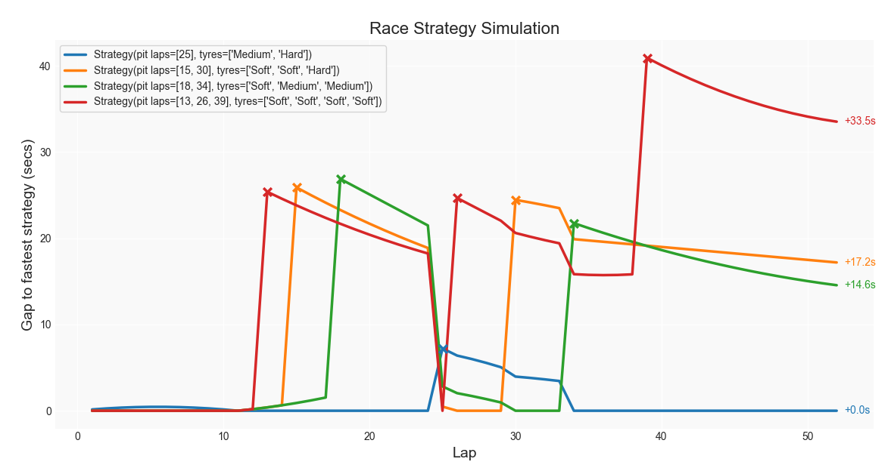

# F1 Strategy Simulator

Simulating the strategy options for a race. For this example, I've taken lap times and tyre information from the broadcast of the 2025 British Grand Prix, so some of the numbers may be a bit off compared to the real data. 

## Author:
Nathan Sizer – [LinkedIn](https://www.linkedin.com/in/nathan-sizer)

## Classes

### Main

The entry point of the simulator, runs simulations using the other classes below.

### Tyre

Defines and models the tyres being used for the race. In our example the C4 is the soft tyre, C3 is the medium tyre and C2 is the hard. I'm using the base offset from the TV broadcast, the medium was estimated to be 0.05-0.15 seconds slower (when brand new) than the soft, and the hard 0.30-0.45 seconds slower than the soft (when brand new). I'm using the worst case scenario numbers in my simulations. In terms of degredation rate, I'm just going to be using some arbitrary numbers as I don't have access to this kind of data. I'll be working this out based on the soft tyre degrading by 0.08 seconds per lap, the medium will be 0.05 seconds per lap, and the hard 0.03 seconds per lap. The same thinking applies for my tyre life numbers, let's say the soft will last 18 laps, the medium 28 laps and the hard 40 laps.

### Strategy

Defines a specific strategy: the lap numbers of each pit stop and the sequence of tyres for each of the stints.

### Race

Models a race using defined strategies. In our example, the 2025 British GP had 52 laps, I'm using a base lap time of 92 seconds (1m32s) and a pit loss of 25 seconds. Again, this isn't using the most accurate data and is mainly some arbitrary figures I've worked out, at the end of the day what matters here is the logic behind the simulations and the "plug and play" aspect of this code.

### StratGraph

Plots all the strategies on a visual graph.

## Screenshots

An example of the output graph this simulator presents you with. Once again, I'm using arbitrary figures/data, but real (and much more accurate) data can be plugged in.

## Reflections

Overall, I'm happy with how this is turning out. Yes, it could look a bit prettier and there's definitely room for improvement in terms of functionality, but I'm happy with the logic and how it all works.

## TODO

Things I'm going to add to this in the future:

- Add a visual representation of all the strategies, rather than just printing the best as text. (DONE)
- Implement the tyre deg "cliff" where lap times fall off after a certain number of laps, creating a more realistic and less linear model (we have the lifespan already in place).
- Include a little bit of randomness in the pit lane loss, to account for the variation in tyre changing times and possible slow stops.
- Create an external, editable config file for tyre and race data

 
